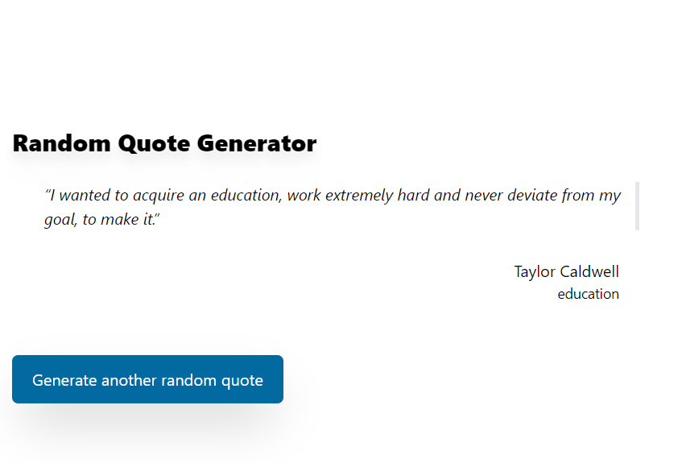

# Random quote generator

Solution for a challenge from  [Devchallenges.io](http://devchallenges.io).

[Demo](https://quote-generator-tinoreyna1984.vercel.app/) | 
[Solution](https://github.com/tinoreyna1984/quote-generator) | 
[Challenge](https://devchallenges.io/challenges/8Y3J4ucAMQpSnYTwwWW8)

## Table of Contents

- [Overview](#overview)
- [Built With](#built-with)
- [Features](#features)
- [How to use](#how-to-use)
- [Contact](#contact)
- [Acknowledgements](#acknowledgements)

## Overview



This is a quote generator. The following stories are fulfilled:
* You can see a random quote.
* You can generate a random quote.
* A quote goes with its genre.
* If you click on the author, you can see all of his quotes. Initially limited to 10, but there is a button below the list to fetch more quotes until reaching the total quotes from the author.
* Improvement TODO: after fetching, render partially any fetched quotes without loading again the list (the API paginates the quotes list).

### Built With

- [Next.js](https://nextjs.org/)
- [TailwindCSS](https://tailwindcss.com/)
- [Redux Toolkit](https://redux.js.org/)

## Features

This application/site was created as a submission to a [DevChallenges](https://devchallenges.io/challenges) challenge. The [challenge](https://devchallenges.io/challenges/8Y3J4ucAMQpSnYTwwWW8) was to build an application to complete the given user stories.

## How To Use

To clone and run this application, you'll need [Git](https://git-scm.com) and [Node.js](https://nodejs.org/en/download/) (which comes with [npm](http://npmjs.com)) installed on your computer. From your command line:

```bash
# Clone this repository
$ git clone https://github.com/tinoreyna1984/tino-tasker

# Install dependencies
$ npm i

# Run the app
$ npm run dev
```

## Acknowledgements

- [Node.js](https://nodejs.org/)
- [Marked - a markdown parser](https://github.com/chjj/marked)
- My teachers.

## Contact

- Website [TinexLab](https://tinexlab.vercel.app/)
- GitHub [@tinoreyna1984](https://github.com/tinoreyna1984)
- Twitter [@tinoreyna1984](https://twitter.com/tinoreyna1984)
